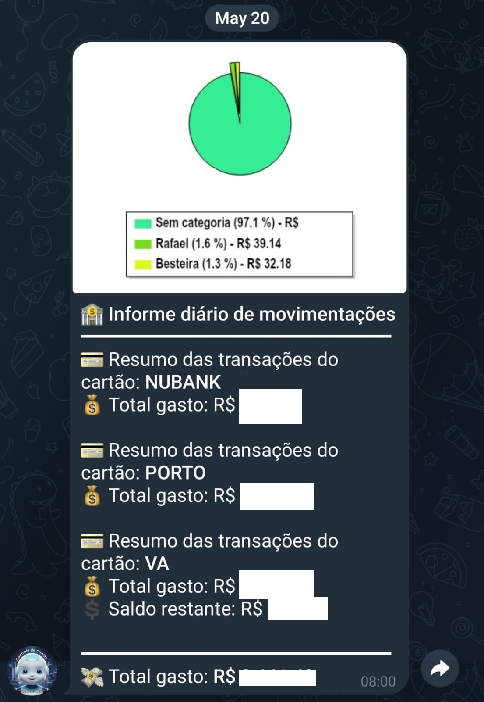
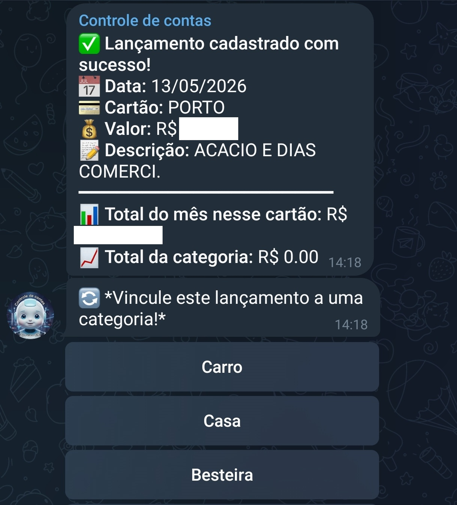
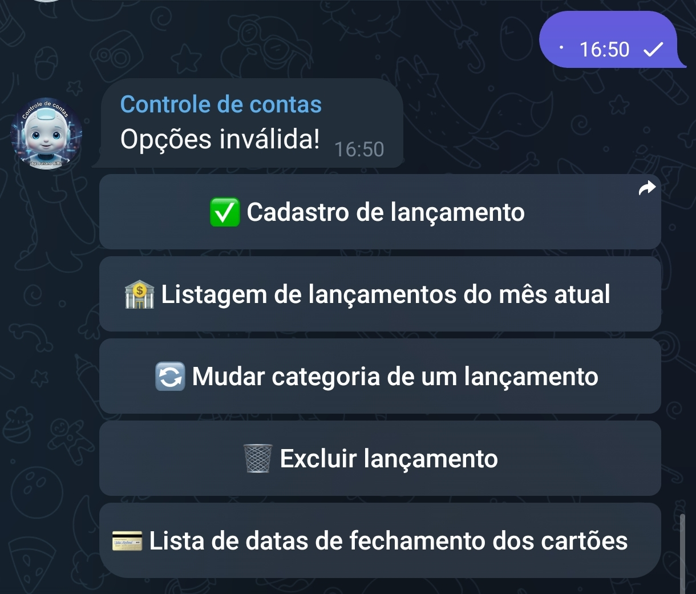

# 🤖 TelegramBotManager

<div align="center">
  <p>A robust backend application built with <strong>Azure Functions</strong> and <strong>C# (.NET 9)</strong> to manage financial transactions through a Telegram Bot. It seamlessly integrates with push notifications and banking alerts to help you take control of your finances.</p>
</div>

---

## 📖 Overview

**TelegramBotManager** acts as the central hub for receiving, parsing, and storing financial data. It is primarily fed by **[NotificationReader](https://github.com/JulianoBiffi/NotificationReader)**, an Android app that captures smartphone push notifications (from banks and credit cards) and forwards them to this backend via HTTP POST. 

Once received, this application uses a Telegram Bot interface to categorize expenses, manage credit card closing dates, and send daily consolidated financial reports right to your phone! 📱💸

### 📸 Previews

Here are some previews of the Bot in action:

<div align="center">
  
  
  
</div>

## ✨ Features

- **Automated Bank Parsing:** Captures push notifications and auto-saves bank transactions.
- **Telegram Bot Integration:** Manage your finances completely via Telegram interactive menus.
- **Expense Categorization:** Assign categories to new transactions dynamically.
- **Daily Financial Reports:** Automatically generates and sends a daily summary (with pie charts 🥧) to your Telegram group every morning at 08:00 AM.
- **Asynchronous Queue Processing:** Built heavily on Azure Storage Queues to prevent Webhook timeouts and ensure no message is ever lost.

## 💬 Bot Commands

The Telegram Bot interacts via rich interactive menus and inline queries. Here are the main commands available:

| Command | Icon | Description |
|---|---|---|
| `/cadastro` | ✅ | Manually registers a new financial transaction (Date, Credit Card, Value, Description, Installments). |
| `/relatoriomensal` | 🏦 | Lists all transactions for the current month. |
| `/editarlancamentosdomes` | 🔄 | Allows changing the category of an existing transaction. |
| `/excluirlancamentos` | 🗑️ | Deletes a previously registered transaction. |
| `/listafechamentocartoes` | 💳 | Lists the closing and best-day-to-buy dates for all registered credit cards. |
| `/definircategoria` | 🏷️ | Binds a transaction to an existing category. |
| `/cadastrarcategoria` | 🆕 | Registers a brand new category in the system. |

## 🏗️ Architecture & Patterns

This project enforces strict software engineering best practices:
- **Clean Architecture & SOLID:** Highly decoupled layers ensuring maintainability.
- **CQRS Pattern:** Implemented via [MediatR](https://github.com/jbogard/MediatR), cleanly separating intent (Commands) from handling.
- **Domain-Driven Design (DDD):** Rich domain models with `Value Objects` (like `Money` and `CreditCard`) ensuring the system never deals with invalid primitive states.
- **Message Router:** A custom `ITelegramMessageRouter` orchestrates incoming webhook texts and maps them to the correct MediatR Use Case.

## 🚀 Technologies Used

- **C# & .NET 9.0:** (Azure Functions Isolated Worker Model)
- **Supabase (PostgreSQL):** For persistent, relational data storage.
- **Azure Storage Queues:** For resilient, asynchronous message brokering.
- **Telegram.Bot:** Official .NET wrapper for the Telegram Bot API.
- **MediatR:** For the CQRS implementation.
- **ScottPlot:** To generate beautiful financial pie charts directly on the backend.

## ⚙️ How to Run Locally

### Prerequisites
1. [.NET 9.0 SDK](https://dotnet.microsoft.com/download)
2. [Azure Functions Core Tools](https://learn.microsoft.com/en-us/azure/azure-functions/functions-run-local)
3. A Telegram Bot Token (from [@BotFather](https://t.me/botfather))
4. A [Supabase](https://supabase.com/) account and project.
5. [Azurite](https://learn.microsoft.com/en-us/azure/storage/common/storage-use-azurite) for local Azure Storage Queue simulation.

### Setup
1. Clone this repository:
   ```bash
   git clone https://github.com/JulianoBiffi/TelegramBotManager.git
   ```
2. Navigate to the project directory:
   ```bash
   cd TelegramBotManager
   ```
3. Create a `local.settings.json` file in the root directory (this file is git-ignored) and add your secrets:
   ```json
   {
     "IsEncrypted": false,
     "Values": {
       "AzureWebJobsStorage": "UseDevelopmentStorage=true",
       "FUNCTIONS_WORKER_RUNTIME": "dotnet-isolated",
       "Azure_StorageConnectionString": "UseDevelopmentStorage=true",
       "Azure_QueueFinancialControlName": "financial-control-queue",
       "FinancialControl_TelegramBotToken": "YOUR_TELEGRAM_BOT_TOKEN",
       "FinancialControl_AllowedUserIds": "YOUR_TELEGRAM_USER_ID",
       "FinancialControl_AllowedGroup": "YOUR_TELEGRAM_GROUP_ID",
       "SupabaseUrl": "YOUR_SUPABASE_URL",
       "SupabaseApiKey": "YOUR_SUPABASE_API_KEY"
     }
   }
   ```
4. Run Azurite in the background.
5. Start the Azure Functions locally:
   ```bash
   func start
   ```

## ☁️ Deployment

The project is fully configured for automated deployments. A Continuous Integration and Continuous Deployment (CI/CD) pipeline is set up using **Azure Pipelines**. 

Every push to the main branch automatically triggers a build and deploys the latest version directly to the Azure Functions environment. Ensure that all App Settings (like `FinancialControl_TelegramBotToken` and `SupabaseApiKey`) are properly configured in your Azure Portal.

## 🔗 Related Projects

- **[NotificationReader](https://github.com/JulianoBiffi/NotificationReader):** The Android mobile application responsible for reading smartphone push notifications and sending them to this TelegramBotManager backend.

---
*Developed with ❤️ for better financial tracking.*
